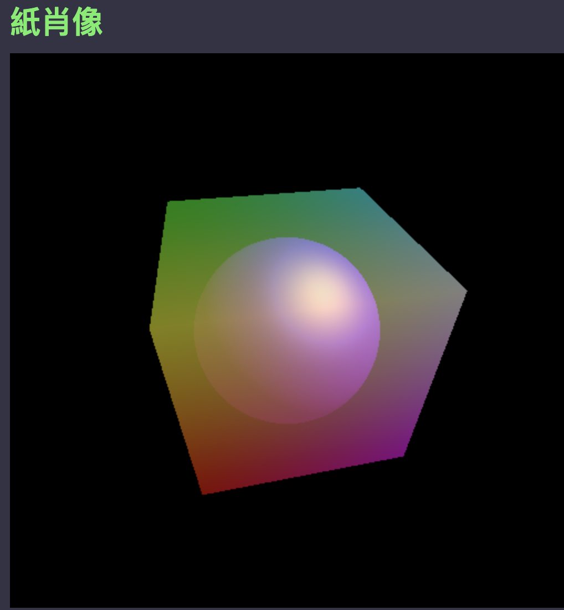

# javascript-shaders

Exploring writing GL shaders in Javascript using three.js.
The three.js model involves writing shaders (the cube uses
a Fragment Shader that interpolates the vertex colors for
each face). The vertex colors are provided to the shader
from the polygon's Material which references the shader and
also specifies the vertex colors for each face.

